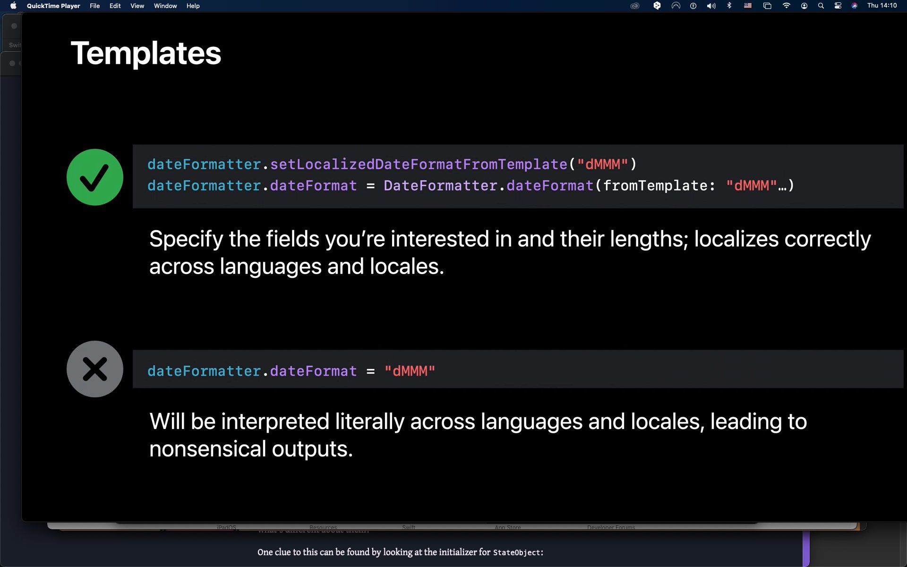

# Test for localisation of dates on device.  

## how to autoupdate the date string depending of device language settings

The code is fairly simple but what trew mw off path at first is that it is not enough to create a formatter like:
```swift
	var today: String {
		let date = Date()
		let formatter = DateFormatter()
		formatter.locale = .autoupdatingCurrent
		formatter.setLocalizedDateFormatFromTemplate("E")
		return formatter.string(from: date)
	}
```
True that 'formatter.locale = .autoupdatingCurrent' will auto update according to changes to the current language setting of the simulator or device in setting/general/language.  

I use `formatter.setLocalizedDateFormatFromTemplate("E")` as recommended in this WWDC video:  
https://developer.apple.com/forums/thread/97252?answerId=295557022#295557022   

<br>
<p align="center">
 &nbsp;&nbsp;&nbsp;&nbsp;&nbsp;
</br>
</p>


*But don't forget to add those languages in your project!*  

In the project navigator (View > Navigator > Show Project Navigator), select your project at the top.  
In the editor displayed, select your project at the top of the list on the left.  
Switch to the Info tab.  
In the Localizations slice, press the add (+) button and select the language from the list.  

If you do not add the language, the settings will let you choose the language but the date will not be updated in the new language!  


<br>
<p align="center">
 &nbsp;&nbsp;&nbsp;&nbsp;&nbsp;
</br>
</p>
